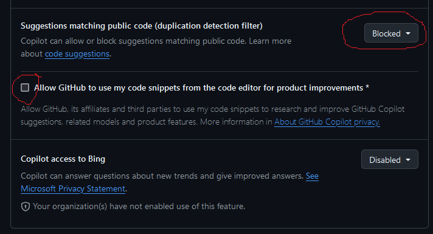
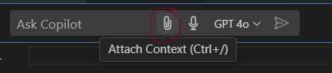

<!-- Check whether the assignment is ready to release -->
{{site.time | date: '%Y%m%d'}}
{{page.due_date | date: '%Y%m%d'}}
 
<div class="alert alert-danger">

Warning: this assignment is out of date.  It may still need to be updated for this year's class.  Check with your instructor before you start working on this assignment.
</div>

<!-- End of check whether the assignment is up to date -->


<!-- Check whether the assignment is up to date -->
{{'now' | date: '%Y'}}
{{page.due_date | date: '%Y'}}
 
<div class="alert alert-danger">
Warning: this assignment is out of date.  It may still need to be updated for this year's class.  Check with your instructor before you start working on this assignment.
</div>

<!-- End of check whether the assignment is up to date -->


<div class="alert alert-info">
This assignment is due on {{ page.due_date | date: "%A, %B %-d, %Y" }} at {{ page.due_date | date: "%I:%M%p" }} EST. 
</div>


<div class="alert alert-info">
You can download the materials for this assignment here:
<ul>

<li><a href="{{item.url}}">{{ item.name }}</a></li>

</ul>
</div>


<div class="alert alert-info">
Submission link:
<a href="{{page.submission_link}}">{{ page.submission_link }}</a>

</div>

{{page.type}} {{page.number}}: {{page.title}}
=============================================================
## Learning Objectives
* Figure out how to write a problem for a planning program.
* Determine how utility functions within Sabre.
* Compare and contrast the planner's behavior to when a game would be played by a human.
* Generate a planning problem using a code-based LLM.
* Compare the processes of generating a planning problem by hand vs LLM

## Introduction
In this homework, you will be converting an interactive fiction game into [Sabre](http://cs.uky.edu/~sgware/projects/sabre/)'s syntax by hand and via LLM. 


## Working with Sabre
In this first part, you will be creating a planning problem following the syntax of Sabre and then running your problem through the Sabre planner.

[Sabre](http://cs.uky.edu/~sgware/projects/sabre/) tries to find a story based on a set of limits.
It has three different types of limits:
* **author temporal limit**: "maximum number of actions in the author’s plan—that is, the actual actions that will be executed to raise the author’s utility" (`-atl` flag)
* **character temporal limit**: "maximum number of actions in a plan a character imagines when justifying an action" (`-ctl` flag)
* **epistemic limit**: "how deeply Sabre will search into a character’s theory of mind" (`-el` flag)

Whether a limit is reached is calculated by looking at the **utility** of the overall problem (`utility()`) or the utility of a particular character's perspective (e.g., `utility(Princess)`).

The above definitions and more information can be found in the report [A Collection of Benchmark Problems for the Sabre Narrative Planner](sabre-report.pdf).

## Part 1: Make a Planning Problem by Hand
The skeleton of a problem has been provided to you in [this notebook]({{page.materials[0].url}}). Again, you can open this notebook in [Colab](https://colab.research.google.com/), [Deepnote](https://deepnote.com/), or VSCode.

<div class="alert alert-info">
I've set up everything so that you just need to implement the parts in the string that say "TODO". No need to try to convert the Sabre code into Python or Java. Also, note that I have already declared all of the types, entities, properties, and starting state conditions for you.
</div>

There are 11 actions that you will be implementing. The pre-conditions and effects are listed in the notebook for each one. You just need to write Sabre code for them.


To write a problem for Sabre, do the following:
1. Download one or a couple of the problems from the list [https://github.com/sgware/sabre-benchmarks/tree/main/problems](https://github.com/sgware/sabre-benchmarks/tree/main/problems) 
to use as reference.
2. Note the syntax used in the example Sabre problems to make a planning problem for the first Action Castle game. You will implement the **Actions** from Action Castle in your plan. There are 11 of them in total.
3. Download the [notebook for running Sabre]({{page.materials[0].url}}) and test your file. You can also run one of the example files to see what a successful plan looks like.
4. Implement the Sabre code within the `"""` giant string within the variable `problem`.
5. Sabre might take several minutes to find a plan. **Tip: You might want to change the heuristic flags to relax the problem.**
6. Iterate until Sabre can *solve* your problem. **Tip: To debug your problem once your syntax bugs are fixed, you can try changing your utility to a smaller problem until you know the paths are available. For example, set your utility to `location(Player) == GardenPath` if you're trying to make sure your walk action works.**
Also, the deeper the goal is, the longer the planner is going to take to run. 


<div class="alert alert-info">
Important notes:
<ul>
<li>You are not allowed to use any LLM or generated text for this part of the homework.</li>
<li>Do not use the "consenting" and "observing" components. This makes the problems difficult to debug.</li>
<li><code>null</code> in Sabre is <code>?</code></li>
</ul>
</div>


## Part 2: Experiment with Utility
For Part 2, you will show how well your problem from Part 1 works by changing the `utility()` function---i.e., the goal test.

1. (2 pts) Set your `utility()` as the following block:
```
utility():
	if(royal(Player)) 1 else 0;
```
run it and collect & report the plan you get (for context this utility takes my solution about 3 minutes to plan through),
and then replace it with
```
utility():
	if(inv(Crown) == Player) 1 else 0;
```
and run that and collect & report that plan.
	* Copy and paste each plan that you get (printed at the end of the output when you run the Java command) into a word document.
2. (2 pts) How might the above plans compare to if someone was playing this game? How might the actions differ? (1-3 sentences)
3. (2 pts) Change the `walk()` action to allow all characters to walk around, not just the Player. Try it with both of the utilities from  Question 1.
	* Copy and paste the 2 resulting plans & share your impressions on how the story has changed.
4. (2 pts) Does allowing the other characters to walk around result in a more interesting story? If so, why? If not, why not? (2-3 sentences)
5. (2 pts) In addition to your new `walk()` action, change the `utility()` functions from Question 1 to be for any character, not just the Player.
  * Copy and paste the 2 resulting plans & share your impressions on how the story has changed.
6. (2 pts) How might the output of a planner like Sabre be used to generate stories? What qualities might those stories have?


## Part 3: Use GitHub Copilot (or other code-based LLM) for Problem Creation

### Setting up GitHub Copilot
You can find the instructions here: [https://code.visualstudio.com/docs/copilot/setup](https://code.visualstudio.com/docs/copilot/setup)

But it essentially is:
1. Get access to [GitHub Copilot](https://github.com/features/copilot), you can sign up for a [free student account](https://github.com/education/students). The free plan should be enough.
2. Make sure to **block** suggestions matching public code and **uncheck** allowing GitHub to use your code snippets to train on.
 
3. To use it, you can either install the extension on VSCode & link it to your GitHub account, install the [standalone application](https://github.com/features/copilot), or [use it online](https://github.com/copilot).

Then you should be ready to go!

### Generating a Planning Problem from wikiHow
We'll now use the coding LLM to write a Sabre problem for a wikiHow article.  The goal for this is to start from something that describes procedures and actions and is written in natural language, and then have the model translate it into the description language used for automated planning.

Here are a handful of wikiHow articles that I thought might be interesting since they had some elements that could make for interesting stories.  It's fine to pick your own article from wikiHow outside of this list.   **You shouldn't translate the whole article, just a few steps, so you can pick out the parts that you think are most relevant/easiest/interesting to create a domain from.**


Survival Stories
* [How to Survive in the Woods](https://www.wikihow.com/Survive-in-the-Woods)
* [How to Survive in the Jungle](https://www.wikihow.com/Survive-in-the-Jungle)
* [How to Survive on a Desert Island](https://www.wikihow.com/Survive-on-a-Desert-Island
) 
* [How to Survive on a Deserted Island With Nothing](https://www.wikihow.com/Survive-on-a-Deserted-Island-With-Nothing)
* [How to Get Out of Quicksand](https://www.wikihow.com/Get-Out-of-Quicksand)
* [How to Open a Coconut](https://www.wikihow.com/Open-a-Coconut)
* [How to Test if a Plant Is Edible](https://www.wikihow.com/Test-if-a-Plant-Is-Edible)
* [How to Find True North Without a Compass](https://www.wikihow.com/Find-True-North-Without-a-Compass)
* [How to Survive a Wolf Attack](https://www.wikihow.com/Survive-a-Wolf-Attack)

Detectives
* [How to Make a Detective Kit](https://www.wikihow.com/Make-a-Detective-Kit)
* [How to Disguise Yourself](https://www.wikihow.com/Disguise-Yourself)
* [How to Make a Hidden Camera](https://www.wikihow.com/Make-a-Hidden-Camera)
* [How to Spy on People](https://www.wikihow.com/Spy-on-People)
* [How to Hack](https://www.wikihow.com/Hack)
* [How to Make a Grappling Hook](https://www.wikihow.com/Make-a-Grappling-Hook)
* [How to Open a Locked Door](https://www.wikihow.com/Open-a-Locked-Door)
* [How to Create a Secret Society](https://www.wikihow.com/Create-a-Secret-Society)

Dystopian Futures
* [How to Survive a Comet Hitting Earth](https://www.wikihow.com/Survive-a-Comet-Hitting-Earth)
* [How to Survive an EMP](https://www.wikihow.com/Survive-an-EMP)
* [How to Survive a Nuclear Attack](https://www.wikihow.com/Survive-a-Nuclear-Attack)
* [How to Build a Fallout Shelter](https://www.wikihow.com/Build-a-Fallout-Shelter)
* [How to Survive a Riot](https://www.wikihow.com/Survive-a-Riot)
* [How to Survive Under Martial Law](https://www.wikihow.com/Survive-Under-Martial-Law)
* [How to Avoid Danger During Civil Unrest](https://www.wikihow.com/Avoid-Danger-During-Civil-Unrest)
* [How to Thwart an Abduction Attempt](https://www.wikihow.com/Thwart-an-Abduction-Attempt)


#### If you are using Copilot in VSCode
1. Download an example problem from [https://github.com/sgware/sabre-benchmarks/tree/main/problems](https://github.com/sgware/sabre-benchmarks/tree/main/problems) (or the problem you just wrote for Part I).
2. Import the problem file in VSCode/Copilot.
3. Create a new .txt file for the problem you plan to generate.
4. Open the file and press CTRL + I to open Copilot.
5. Add an example problem file as an attachment in the prompt (as shown in image).

6. Write your prompt.
7. Save the file and [run it through Sabre]({{page.materials[0].url}}).
8. If it is close, count the number of edits you need to make to get it to run. If it's pretty far off from what you wanted, generate it again.

#### If you are using Copilot in the standalone app or online
1. Download an example problem from [https://github.com/sgware/sabre-benchmarks/tree/main/problems](https://github.com/sgware/sabre-benchmarks/tree/main/problems) (or the problem you just wrote for Part I).


### What to submit for Part 3
 
<div class="alert alert-info">
In order to get full points for Part 3, you need to share:
<ul>
<li>(2 pts) The prompt(s) that you used.</li>
<li>(2 pts) The original code that the model generated.</li>
<li>(4 pts) That Sabre is able to find a solution in the generated problem. Show its solution.</li>
<li>(4 pts) The list of changes that you made to the generated code to get it to work in Sabre.</li>
<li>(4 pts) Your insight on how the process of creating a problem with an LLM differs from writing it by hand. (A short paragraph)</li>
</ul>
</div>


## What to submit
You should submit the following:

* A Jupiter notebook with your completed planning problem from Part 1.
* A PDF file containing your answers to Parts 2 and all the information requested for Part 3.


Submissions should be done on [Blackboard]({{page.submission_link}}).


## Grading
<div class="alert alert-warning" markdown="1">
* Part 1 - 22 points (2 points per action)
* Part 2 - 12 points
* Part 3 - 16 points
</div>

 
## Recommended readings

* {{ reading.authors }}, <a href="{{ reading.url }}">{{ reading.title }}</a>.  <i>{{ reading.note }}</i>


